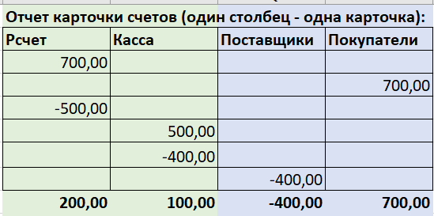
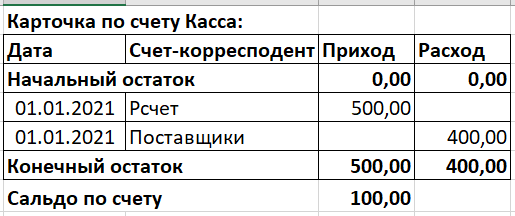
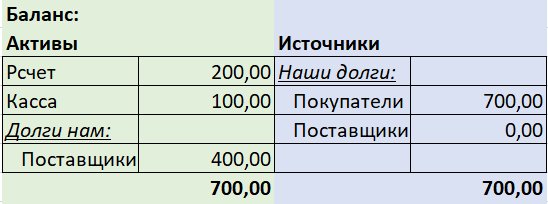

# Курсовая работа

*По курсу Python basic*

## Цели проекта

- Создать на Django интерфейс к простой базе данных
- Использовать авторизацию *(¿сессии или JWT?)* и доступ для групп пользователей
- Создать отчеты и представления для данных с фильтрами
- Развернуть с Postgres и nginx

## Что планировалось

1. Небольшая база данных
    - система управленческого учета на основе принципа двойной записи,
      которая позволяет после проведения операции видеть ее результат 
      и влияние на состояние активов, источников, а также изменение 
      баланса предприятия в целом.
2. Несколько отчетов
    - Карточки счетов.
        - позволяют видеть начальные остатки, движения и конечные остатки по счетам за любой период.

        

        

    - карточка счета

      

      

    - баланс

      

      

3. Права доступа на основе групп
    - Группы:
        - Смотрящие - могут только просматривать отчеты
        - Операторы - могут вносить данные
        - Админы
4. Deploy

## Используемые технологии

- Django
- Bootstrap
- Docker

## Что получилось

[github](https://github.com/shaj/balukaa/tree/OTUS)

1. Получившаяся модель вполне соответствует требованиям к базе
2. Реализован 1 отчет из необходимых 3
    - Не оптимизированы запросы к БД. Для создания отчета из 4 строк требуется до 18 запросов к БД
3. Права доступа
    - Пока на основе сессий
    - Создание групп не реализовано
4. В github workflow происходит создание образа в Docker-е
    - Дальше этот образ не используется.

## Схемы / архитектура

## Выводы

