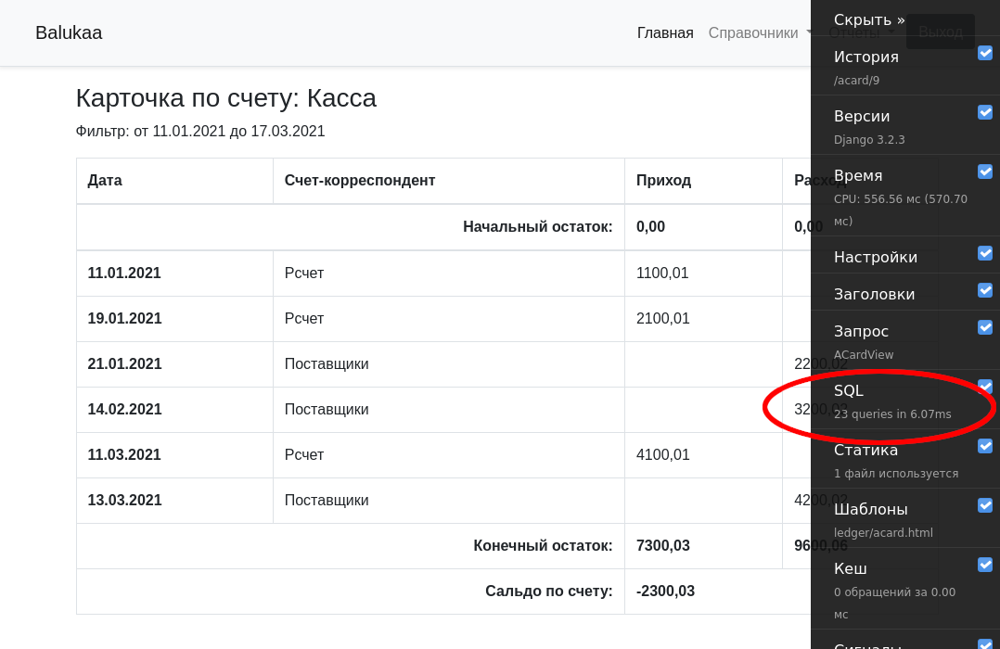

# Курсовая работа

*По курсу Python basic*

## Цели проекта

- Создать на Django интерфейс к простой базе данных
- Использовать авторизацию и доступ для групп пользователей
- Создать отчеты и представления для данных с фильтрами
- Собрать рабочий Docker образ с приложением

## Что планировалось

1. Небольшая база данных
    - система управленческого учета на основе принципа двойной записи,
      которая позволяет после проведения операции видеть ее результат 
      и влияние на состояние активов, источников, а также изменение 
      баланса предприятия в целом.
    - справочник "План счетов"

      

    - журнал "Бухгалтерские проводки"

      

    - регистр "Движение по счетам"

      

2. Несколько отчетов
    - Карточки счетов. Позволяют видеть начальные остатки, движения и конечные остатки по счетам за любой период.

      

    - карточка счета. Подробнее по конкретному счету.

      

    - баланс

      

3. Права доступа на основе групп
    - Группы:
        - Смотрящие - могут только просматривать отчеты
        - Операторы - могут вносить данные
        - Админы
4. Deploy

## Используемые технологии

- Django
- Bootstrap
- Docker

## Что получилось

[github](https://github.com/shaj/balukaa/tree/OTUS)

1. [Получившаяся модель](balukaa/ledger/models.py) вполне соответствует требованиям к базе. Регистр "Движение по счетам"
   пока реализован на основе запроса к журналу "Бухгалтерские проводки".
2. Реализованы представления списка проводок и плана счетов.

   

   

    - Не реализован фильтр по датам для проводок.
3. Реализована форма создания и редактирования проводки.

   
   

4. Реализован отчет "Карточка счета"

   

    - Для создания отчета использовались [методы класса модели](balukaa/ledger/models.py#L29-L115)
      и метод [get_context_data](balukaa/ledger/views.py#L87-L145) представления ACardView.
    - Не оптимизированы запросы к БД. Для создания отчета из 6 строк требуется 27 запросов к БД.

      

5. Права доступа
    - На основе сессий
    - Создание групп не реализовано
    - Доступ к отчетам и представлениям разрешен для любого авторизованного пользователя. С помощью [`LoginRequiredMixin`](balukaa/ledger/views.py#L30).
    - Доступ к созданию или изменению проводки разрешается с помощью [`PermissionRequiredMixin`](balukaa/ledger/views.py#L50-L52)
6. В github workflow происходит создание образа в Docker-е
    - В образе запускается uvicorn командой `gunicorn --bind 0.0.0.0:8080 balukaa.asgi:application -k uvicorn.workers.UvicornWorker`
    - На hub.docker.com пушится 

## Схемы / архитектура

## Выводы

